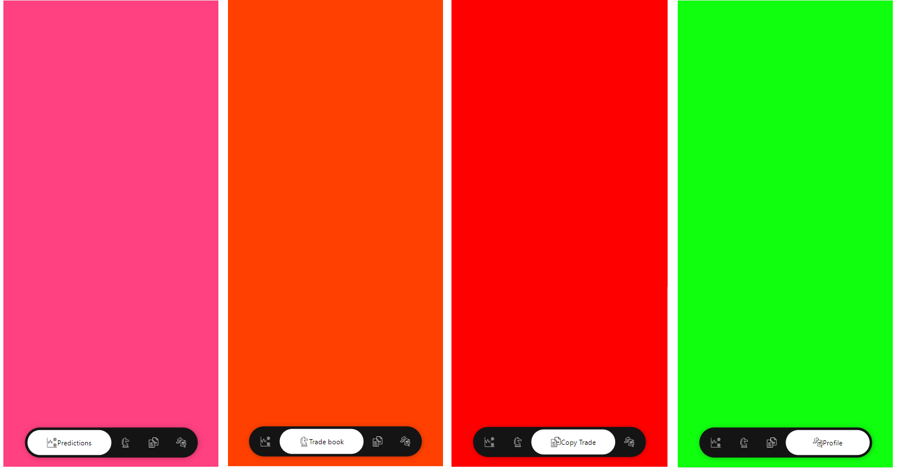

<video width="320" height="240" controls>
  <source src="assets/custom\ navigation.mp4" type="video/mp4">
</video>
</img>

This is a simple react native expo project for building custom navigation.
It is roundish float bottom navigation bar with the swipe action.

